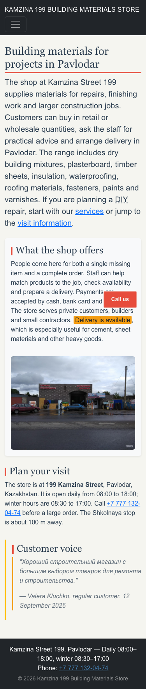
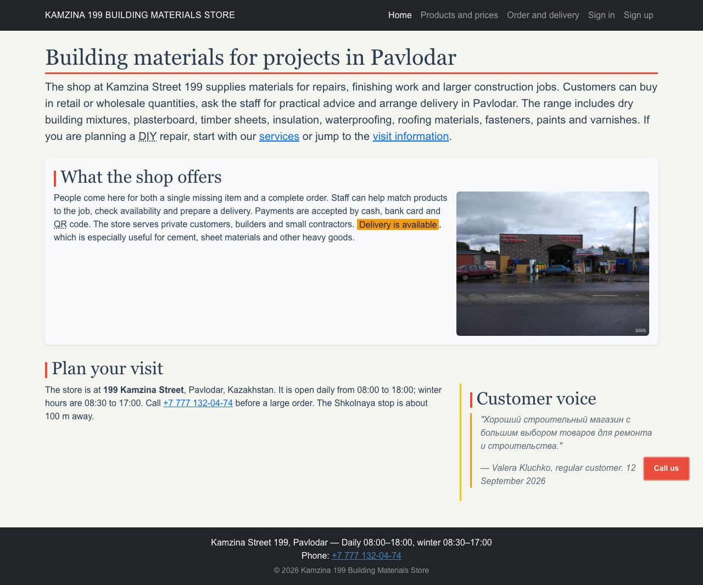
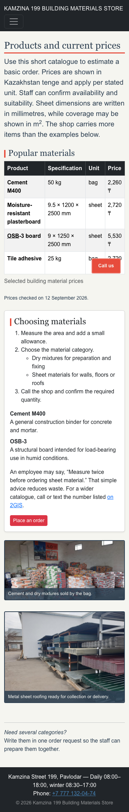
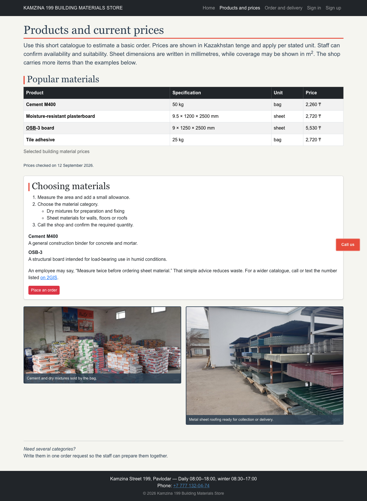
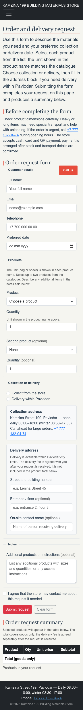
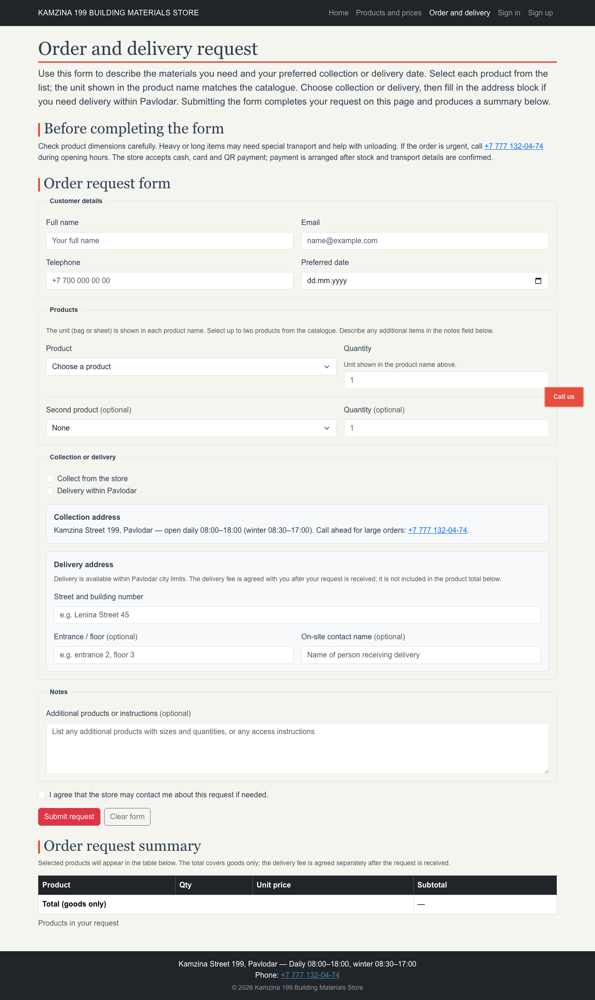
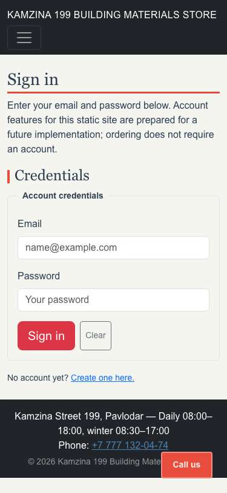
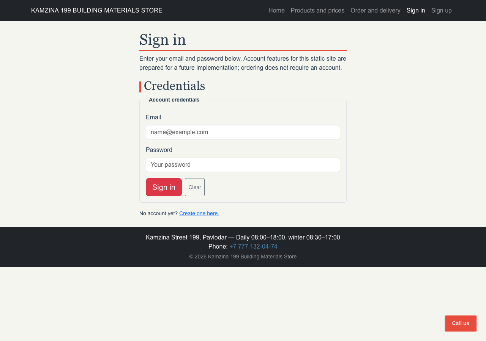
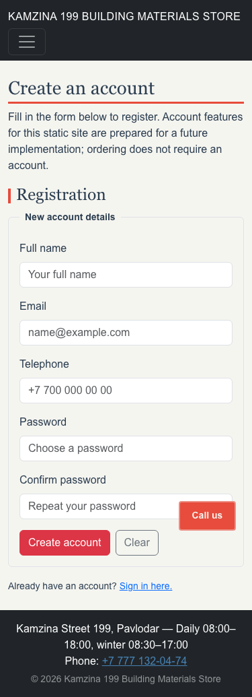
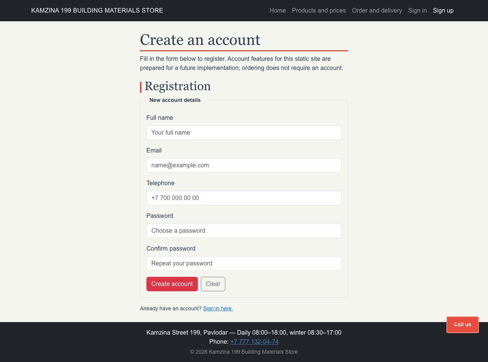

# Kamzina 199 Building Materials Store

diMidterm project website for a real building materials store at 199 Kamzina Street, Pavlodar.
Built with Bootstrap 5.3.3 and a thin custom branding stylesheet.

**Bootstrap version:** 5.3.3 (CDN: jsDelivr)

## Open the site

Open `index.html` directly in a browser. Use the navigation menu to move between pages.
No build step or server is required.

## Pages

- `index.html` — home page: store overview, services, visit information
- `products.html` — product catalogue with prices, Bootstrap table and card
- `order.html` — order and delivery request form with product selection, delivery address, and on-page summary
- `signin.html` — sign-in interface (account features prepared for future implementation)
- `signup.html` — registration interface (account features prepared for future implementation)

## Screenshots

### Home page

| Mobile (375 px) | Desktop (1280 px) |
|---|---|
|  |  |

### Products and prices

| Mobile (375 px) | Desktop (1280 px) |
|---|---|
|  |  |

### Order and delivery

| Mobile (375 px) | Desktop (1280 px) |
|---|---|
|  |  |

### Sign in / Sign up

| Sign in — mobile | Sign in — desktop | Sign up — mobile | Sign up — desktop |
|---|---|---|---|
|  |  |  |  |

## Three visitor journeys

### 1. Browse products and place an order

**Start:** Open `index.html`.  
**Steps:**  
1. Read the store description and click **Products and prices** in the navigation.  
2. Review the product table (catalogue items with units and prices).  
3. Click **Place an order** in the "Choosing materials" card.  
4. On `order.html`, fill in your name, email, phone and preferred date.  
5. Select a product from the first product row; the unit is shown in the option label.  
6. Enter a quantity. Optionally add a second product.  
7. Choose **Collect from the store** or **Delivery within Pavlodar**.  
8. If delivery: fill in the street address block.  
9. Click **Submit request**.  

**End:** The order request summary section below the form shows the prepared result area.
An on-page confirmation message appears (requires JavaScript to populate).

---

### 2. Request delivery for heavy materials

**Start:** Open `order.html` directly or via navigation.  
**Steps:**  
1. Fill in customer details (name, email, phone, preferred date).  
2. Select **Cement M400 — bag, 50 kg — 2,260 ₸** from the product list and enter quantity.  
3. Select **Delivery within Pavlodar** radio button.  
4. Fill in the delivery address block (street, entrance, on-site contact if needed).  
5. Add any extra instructions in the notes field.  
6. Click **Submit request**.  

**End:** The on-page summary section displays the prepared result layout. The delivery fee
note explains it is confirmed separately after the request is received.

---

### 3. Browse the store, check hours, and call directly

**Start:** Open `index.html`.  
**Steps:**  
1. Read the "What the shop offers" section.  
2. Follow the same-page link to **visit information** (the `#visit` anchor).  
3. Note the opening hours and address: Kamzina Street 199, daily 08:00–18:00.  
4. Click the **Call us** button fixed in the bottom-right corner (or tap the telephone link).  

**End:** The phone app opens with `+7 777 132-04-74` ready to dial.

---

## Repository structure

- `css/base.css` — branding stylesheet: custom properties, typography, positioning, colour, CSS-only nav toggle, and prepared JavaScript state targets
- `css/damir.css` — placeholder (consolidated into base.css)
- `images/` — store photographs
- `screenshots/` — responsive screenshots at 375 px, 768 px and desktop width
- `report/` — assignment reports
- `tag-checklist.md` — HTML tag evidence
- `css-checklist.md` — CSS technique evidence
- `css-removal-list.md` — Bootstrap migration map
- `ai-log.md` — AI assistance log
- `validation-results.txt` — W3C validation record (rerun after final edits)
